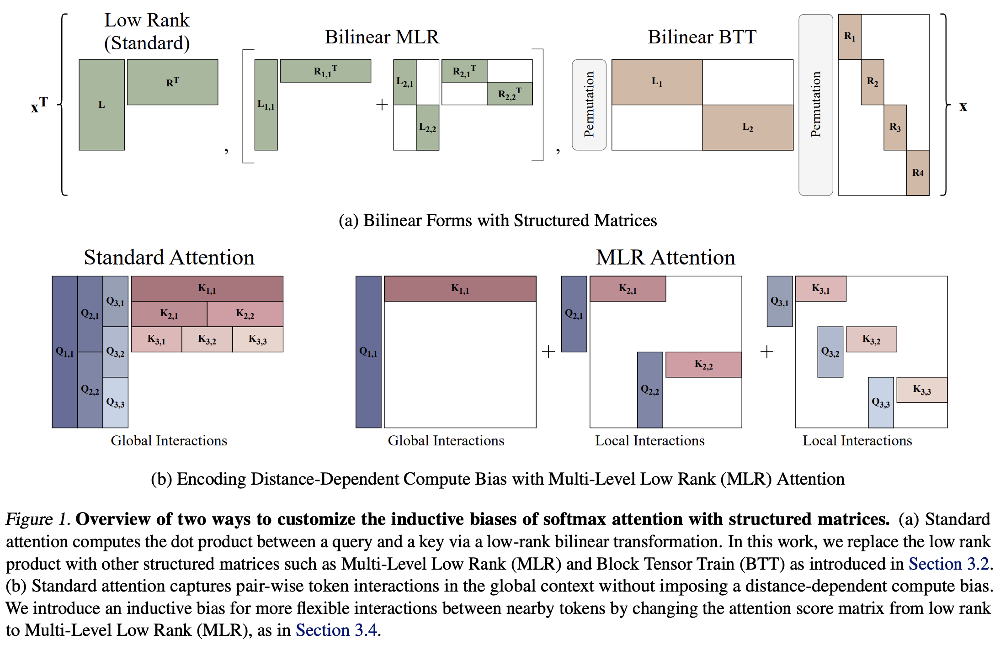

# Customizing the Inductive Biases of Softmax Attention using Structured Matrices

[]()

This repository contains the code for [Customizing the Inductive Biases of Softmax Attention using Structured Matrices](https://openreview.net/pdf?id=Roc5O1ECEt) by [Yilun Kuang](https://yilunkuang.github.io/), [Noah Amsel](https://noahamsel.github.io/), [Sanae Lotfi](https://sanaelotfi.github.io/), [Shikai Qiu](https://shikaiqiu.github.io/), [Andres Potapczynski](https://www.andpotap.com/), and [Andrew Gordon Wilson](https://cims.nyu.edu/~andrewgw/). The codebase builds on the structure of [nanoGPT](https://github.com/karpathy/nanoGPT) and [in-context-learning](https://github.com/dtsip/in-context-learning).


## Introduction

In this work, we customize the inductive bias of attention by changing the structure of its scoring function. Namely, we make the following contributions:

- **Conceptual Framework of Structured Scoring Functions**: We introduce a conceptual framework for analyzing and modifying the inductive biases of attention through the structure of its underlying linear and (bi-)linear transformations.
- **Resolving Low Rank Bottleneck**: we apply this framework to eliminate the low-rank bottleneck of standard attention using high-rank Block Tensor Train (BTT) and contiguous Multi-Level Low Rank (contiguous MLR) matrices, improving performance on an inherently high-dimensional task from the literature. 
- **Generalization of Structured Matrices Family**: we show that both BTT and contiguous MLR matrices—including Monarch, Butterfly, Kronecker, and Low Rank matrices—can be united under a broader structured family which we call Multi-Level Block Tensor Contraction (MLBTC).
- **Encoding Distance-Dependent Compute Bias**: we use contiguous MLR matrices to introduce a distance-dependent compute bias, which slightly outperforms previous methods in language modeling and time series forecasting.



## Environment Installation

```bash
conda env create -f environment.yml
```

## In-Context Regression with BilinearBTT and BilinearMLR

To run experiments on in-context regressions, use the following python script

```sh
python train_ICL.py --n_dims=\"$n_dims\" --n_head=\"$n_head\" --d_model=\"$d_model\" --token_mixing_struct=\"$token_mixing_struct\" --mlr_rank_list=\"$mlr_rank_list\" --mlr_divide_by_num_levels=False --mlr_block_divide_by_num_levels=\"$mlr_block_divide_by_num_levels\" --bilinear_mlr_muP_attn_logits_scaling=False --mha_SP_attn_logits_scaling=\"$mha_SP_attn_logits_scaling\" --training_learning_rate=\"$training_learning_rate\" --training_curriculum_adaptive_inc=True --training_num_training_examples=32000064 --wandb_entity=<TODO> --out_dir=<TODO>'"
```

An example job submission scripts with concrete values is in `./scripts/icl_regression/submit_icl_regression.sh`.

## Language Modeling with MLR Attention

### Configs

The original configuration files from [nanoGPT's GitHub repository](https://github.com/karpathy/nanoGPT/tree/master/config) have been relocated to:

```bash
config/dense_configs/
```

The configurations for the current project are stored in:
```bash
config/struct_configs/
```

### Dataset Preparation

We train our language models using the OpenWebText dataset. Our data preprocessing follows from https://github.com/AndPotap/einsum-search/blob/main/data/small_vocab_owt.py

### Training Scripts

To train a language model on the OpenWebText dataset with MLR attention, use the following python script 

```sh
python train.py config/struct_configs/train_struct_gpt2.py --d_model=\"$d_model\" --block_size=\"$block_size\" --token_mixing_struct=\"$token_mixing_struct\" --mlr_rank_list=\"$mlr_rank_list\" --mlr_divide_by_num_levels=\"$mlr_divide_by_num_levels\" --mlr_block_divide_by_num_levels=\"$mlr_block_divide_by_num_levels\" --mha_SP_attn_logits_scaling=\"$mha_SP_attn_logits_scaling\" --batch_size=\"$batch_size\" --init_lr=\"$init_lr\" --d_qk_head=\"$d_qk_head\" --link_function=\"$link_function\" --bilinear_mlr_muP_attn_logits_scaling=\"$bilinear_mlr_muP_attn_logits_scaling\" --sliding_block_size=\"$sliding_block_size\" --gswa_rank_list=\"$gswa_rank_list\" --init_from=\"$init_from\" --out_dir=\"$out_dir\"'"
```

An example job submission scripts with concrete values is in `./scripts/language_modeling/submit_language_modeling_greene.sh`.

## Plotting

We open-source our plotting codes for figures in our paper under `./plots/`

## Citation
Please cite our work if you find it helpful in your work:
```
@article{kuang2025customizeinductivebiasesofattn,
    title={Customizing the Inductive Biases of Softmax Attention using Structured Matrices}, 
    author={Kuang, Yilun and Amsel, Noah and Lotfi, Sanae and Qiu, Shikai and Potapczynski, Andres and Wilson, Andrew Gordon},
    journal={ICML},
    year={2025}
}
```